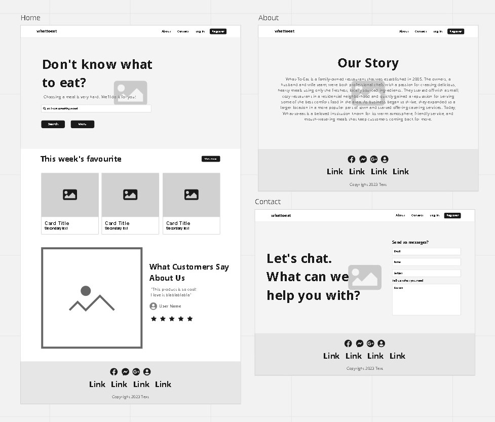
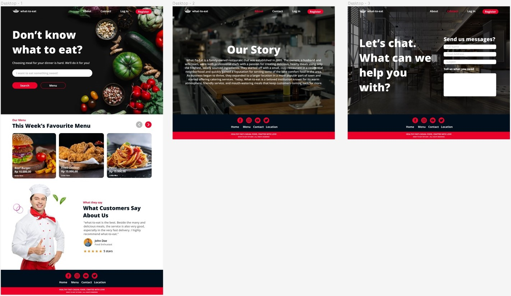

# UI UX

> This is an assignment for UI UX

## Project Description

This website is a platform that helps people decide what to eat their dinner, by generating random healthy meal and it's recipe.

Link Figma: <https://www.figma.com/file/4quBsieCIvrdCkgMg6qmwB/Niko-Setiawan-P?node-id=0%3A1&t=NvKzbf7mjQuIe6LD-0>

Link Miro : <https://miro.com/app/board/uXjVPuW5A_Q=/?share_link_id=702288466772>

Inspiration :<https://www.behance.net/gallery/161891959/Food-landing-page?tracking_source=search_projects%7Cfood+website>
Inspiration :<https://dribbble.com/shots/19642537-Website-Hero-for-Bakery>

## Screenshots

### Miro (Wireframe)

### Figma (Mockup and Prototyping)

